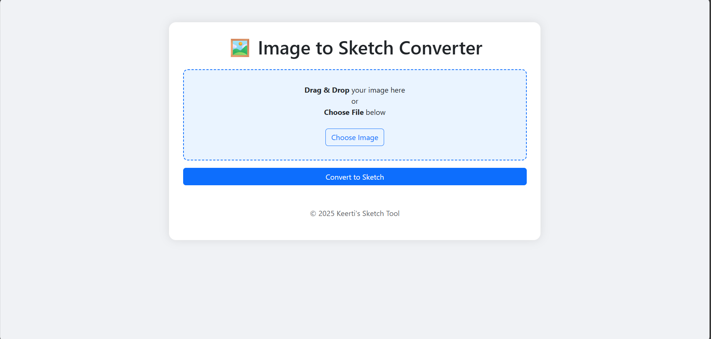
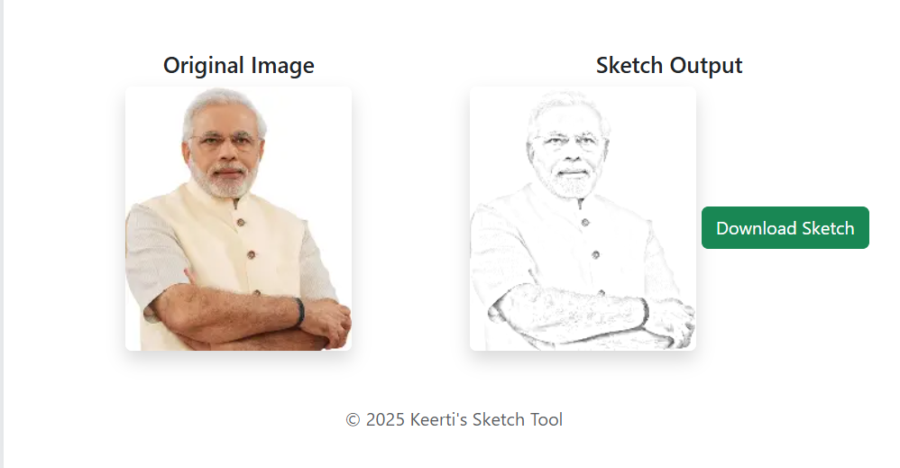

# 🖼️ Image to Sketch Converter 🎨  
Convert any image into a stunning pencil sketch using a sleek, user-friendly web interface.

---

## 📚 Project Overview

**Image to Sketch Converter** is a Python-based web application built with **Flask** and **OpenCV**, allowing users to upload or drag-and-drop an image file and instantly receive a pencil sketch version. It’s lightweight, fast, and ideal for creative transformations.

Whether you’re an artist, designer, or just someone who loves sketch art — this tool gives you a fun and interactive way to convert images into beautiful grayscale sketches.

---

## 🚀 Features

✅ **Drag-and-Drop Image Upload**  
✅ **Traditional "Choose File" Upload Option**  
✅ **Real-time Sketch Conversion Using OpenCV**  
✅ **Displays Original and Sketch Side-by-Side**  
✅ **Download Button to Save Sketch**  
✅ **Responsive and Clean UI with Bootstrap 5**  
✅ **Lightweight Flask Server with Modular Code**  

---

## 📸 Screenshot

---

## 🛠️ Technology Stack

| Technology | Purpose |
|------------|---------|
| **Python 3.13+** | Core Programming Language |
| **Flask** | Web Framework |
| **OpenCV** | Image Processing |
| **HTML5 + CSS3 + Bootstrap 5** | Frontend Styling |
| **JavaScript** | Drag-and-drop logic |
| **Jinja2** | Flask Template Engine |

---
**Keerti Yadav**

github: @yadavkeerti

